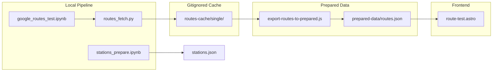

# Routes Implementation

This document describes how bicycle routes between Oslo Bysykkel stations are fetched, cached, exported, and displayed.

## Overview



## Data Flow

1. **Stations** – `stations_prepare.ipynb` extracts unique stations with lat/lon and trip summaries → `prepared-data/stations.json`
2. **Fetch** – `google_routes_test.ipynb` calls `routes_fetch.fetch_route()` to get bicycle routes from the Google Routes API
3. **Cache** – Full API responses are stored in `routes-cache/single/{origin_id}_{dest_id}.json` (gitignored)
4. **Export** – `export-routes-to-prepared.js` reads the cache and writes a slim `prepared-data/routes.json`
5. **Sync** – `npm run prepare:data` copies prepared-data to the frontend
6. **Display** – `/route-test/` loads routes and stations, renders the map with Leaflet

## Components

### routes_fetch.py

Location: `data-pipeline/routes_fetch.py`

- **Purpose:** Fetch bicycle routes via Google Routes API REST, with cache-before-fetch and force-fetch support
- **API:** `fetch_route(origin_id, dest_id, stations, api_key, cache_dir, force_fetch=False)`
- **Cache:** Checks `routes-cache/single/{origin_id}_{dest_id}.json` before calling the API
- **Force fetch:** Set `force_fetch=True` or `FORCE_ROUTES_FETCH=1` to bypass cache
- **Field mask:** Requests `routes.duration`, `routes.distanceMeters`, `routes.polyline`, `routes.viewport`, `routes.legs`, `routes.travelAdvisory`

### Cache Format (routes-cache/)

Each cached file contains:

```json
{
  "origin_id": "377",
  "dest_id": "381",
  "fetched_at": "2026-02-27T19:34:05.592478",
  "response": { /* full Google Routes API response */ }
}
```

The full response includes route legs, steps, navigation instructions, and polylines. Size: ~12 KB per route.

### Export Script (export-routes-to-prepared.js)

Location: `scripts/export-routes-to-prepared.js`

- **Purpose:** Convert full cache to a slim format for the frontend
- **Input:** `routes-cache/single/*.json`
- **Output:** `prepared-data/routes.json`
- **Slim format per route:** `origin_id`, `dest_id`, `duration_sec`, `distance_m`, `encodedPolyline`
- **Size:** ~400 bytes per route (vs ~12 KB in cache)

### Prepared Routes Format

```json
{
  "last_export": { "timestamp": "2026-02-27T18:39:07.851Z" },
  "data": {
    "routes": [
      {
        "origin_id": "377",
        "dest_id": "381",
        "duration_sec": 184,
        "distance_m": 1282,
        "encodedPolyline": "mgulJ__x`ATpCD`@..."
      }
    ]
  }
}
```

### Route Test Page

Location: `frontend/src/pages/route-test.astro`

- **URL:** `/route-test/`
- **Data:** Loads `stations.json` (or `isochrones.json`) and `routes.json`
- **Map:** Leaflet with OpenStreetMap tiles, station markers, route polyline, origin/destination markers
- **Interaction:** Dropdown to select a route; map fits bounds to the selected route and shows trip info (duration, distance)

## Size Considerations

| Format | Per route | 85k routes (full matrix) |
|--------|-----------|---------------------------|
| Full cache | ~12 KB | ~1 GB |
| Slim (prepared-data) | ~400 bytes | ~25 MB |

- **routes-cache/** is gitignored; sync it outside git (e.g. rsync, cloud storage) if needed
- **prepared-data/routes.json** is synced to the frontend and can be committed if size is acceptable

## Commands

| Command | Description |
|---------|-------------|
| `npm run prepare:routes` | Export routes from cache to prepared-data only |
| `npm run prepare:data` | Export routes + sync prepared-data to frontend |
| `npm run build` | Runs prepare:data, then builds the frontend |

## Environment

- **GOOGLE_ROUTES_API_KEY** – Required for fetching; set in `.env` (see `.env.example`)
- **FORCE_ROUTES_FETCH** – Set to `1` to bypass cache during development

## Notebooks

- **stations_prepare.ipynb** – Builds `stations.json` with id, name, lat, lon, trip counts
- **google_routes_test.ipynb** – Tests a single route fetch (e.g. Tøyenparken → Grønlands torg)
