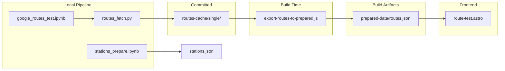

# routes implementation

This document describes how bicycle routes between Oslo Bysykkel stations are fetched, cached, exported, and displayed.

## overview


```mermaid
flowchart LR
    subgraph local [Local Pipeline]
        NB1[stations_prepare.ipynb]
        NB2[google_routes_test.ipynb]
        RF[routes_fetch.py]
    end
    subgraph committed [Committed]
        RC[routes-cache/single/]
    end
    subgraph build [Build Time]
        Export[export-routes-to-prepared.js]
    end
    subgraph artifacts [Build Artifacts]
        Routes[prepared-data/routes.json]
    end
    subgraph frontend [Frontend]
        RT[route-test.astro]
    end
    NB1 --> Stations[stations.json]
    NB2 --> RF
    RF --> RC
    RC --> Export
    Export --> Routes
    Routes --> RT
```


## data flow

1. `stations_prepare.ipynb` extracts unique stations with lat/lon and trip summaries and writes `prepared-data/stations.json`.
2. `google_routes_test.ipynb` calls `routes_fetch.fetch_route()` to request bicycle routes from Google Routes.
3. Full API responses are stored in `routes-cache/single/{origin_id}_{dest_id}.json` (committed cache).
4. `export-routes-to-prepared.js` reads cache files and writes slim data to `prepared-data/routes.json`.
5. `npm run prepare:data` copies `prepared-data` into the frontend.
6. `/route-test/` loads stations and routes and renders them with Leaflet.

## components

### routes_fetch.py

Location: `data-pipeline/routes_fetch.py`

This module fetches bicycle routes through Google Routes API REST. It checks cache files first, and it supports forced refetch through `force_fetch=True` or `FORCE_ROUTES_FETCH=1`.

Available functions:
- `fetch_route(origin_id, dest_id, stations, api_key, cache_dir, force_fetch=False)`
- `fetch_routes_batch(route_pairs, stations, api_key, cache_dir, force_fetch=False)`

The code uses Compute Routes (one origin and one destination per request), not Compute Route Matrix. Batch fetch loops over route pairs and still sends one request per pair.

The field mask is limited to `routes.duration`, `routes.distanceMeters`, and `routes.polyline` to keep response size low.

### cache format (`routes-cache/`)

Each cached file contains:

```json
{
  "origin_id": "377",
  "dest_id": "381",
  "fetched_at": "2026-02-27T19:34:05.592478",
  "response": { /* full Google Routes API response */ }
}
```

With the minimal field mask, the cached response contains only duration, distanceMeters, and polyline. Size: ~1–3 KB per route (vs ~12 KB with full fields).

### export script (`export-routes-to-prepared.js`)

Location: `scripts/export-routes-to-prepared.js`

The script reads `routes-cache/single/*.json` and writes `prepared-data/routes.json`.
Each route in output has `origin_id`, `dest_id`, `duration_sec`, `distance_m`, and `encodedPolyline`.
Output size is around 400 bytes per route, compared to 1 to 3 KB in cache with the minimal mask.

### prepared routes format

```json
{
  "last_export": { "timestamp": "2026-02-27T18:39:07.851Z" },
  "data": {
    "routes": [
      {
        "origin_id": "377",
        "dest_id": "381",
        "duration_sec": 184,
        "distance_m": 1282,
        "encodedPolyline": "mgulJ__x`ATpCD`@..."
      }
    ]
  }
}
```

### route test page

Location: `frontend/src/pages/route-test.astro`

The page is available at `/route-test/`. It loads `stations.json` (or `isochrones.json`) and `routes.json`, then draws markers and route lines with Leaflet.
A route dropdown controls the selected route, and the map fits bounds for that route.

## fetch options and results

### request options we use

The fetch sends a minimal request body:


| Option        | Value                                               | Notes                                  |
| ------------- | --------------------------------------------------- | -------------------------------------- |
| `origin`      | `{ location: { latLng: { latitude, longitude } } }` | Station coordinates                    |
| `destination` | Same structure                                      | Station coordinates                    |
| `travelMode`  | `"BICYCLE"`                                         | Essentials SKU, beta for cycling paths |
| `units`       | `"METRIC"`                                          | Distance in metres                     |


The request does not send `routingPreference`, `departureTime`, `routeModifiers`, or `computeAlternativeRoutes`.

### expected results

- One route per request (no alternatives).
- Duration in seconds (for example `"184s"`).
- Distance in meters.
- Encoded route polyline.
- Route legs are not requested.

### limitations

No shortest-distance option: the API returns the route it considers best for bicycle travel, not strictly shortest distance.

There is no parameter for "shortest distance" in BICYCLE mode.

Not time-dependent: bicycle routes are static. `routingPreference` options apply to `DRIVE` and `TWO_WHEELER`, not BICYCLE.

No historical bicycle routes: past departure times are supported for `TRANSIT`, not BICYCLE.

## size considerations

| Format               | Per route  | 85k routes (full matrix) |
| -------------------- | ---------- | ------------------------ |
| Cache (minimal mask) | ~1–3 KB    | ~85–255 MB               |
| Slim (routes.json)  | ~400 bytes | ~25 MB                   |

- `routes-cache/` is committed and used as source data for routes.
- `prepared-data/routes.json` is generated from cache and is not committed.

## cost optimization

The field mask is trimmed to the minimum required for slim format (`routes.duration`, `routes.distanceMeters`, `routes.polyline`). Omitting `viewport`, `legs`, and `travelAdvisory` reduces server processing and response size, which can lower per-request cost. The main cost lever remains the number of requests; consider fetching only observed station pairs from trip data instead of the full matrix.

## deprecated: medium format

A **medium format** (`routes_medium.json`) was briefly implemented and then removed. It stored per-leg data (route origin + legs with `end_lat`, `end_lon`, `distance_m`, `duration_sec`, `encodedPolyline` per leg) to support multi-leg routes.

Why it was removed: station-to-station bicycle routes in this project return one leg (origin to destination, no waypoints). The medium format added file size and maintenance work with no gain.

Do not reintroduce it unless request requirements change. The current field mask does not request legs.

## commands


| Command                  | Description                                    |
| ------------------------ | ---------------------------------------------- |
| `npm run prepare:routes` | Export routes from cache to prepared-data only |
| `npm run prepare:data`   | Export routes + sync prepared-data to frontend |
| `npm run build`          | Runs prepare:data, then builds the frontend    |


## environment

- **GOOGLE_ROUTES_API_KEY** – Required for fetching; set in `.env` (see `.env.example`)
- **FORCE_ROUTES_FETCH** – Set to `1` to bypass cache during development

## troubleshooting

- If routes are missing in the frontend, run `npm run prepare:data` and check `prepared-data/routes.json`.
- If route fetch fails in notebooks, check `GOOGLE_ROUTES_API_KEY` in `.env`.
- If cache data is stale, set `FORCE_ROUTES_FETCH=1` and rerun fetch for target pairs.

## notebooks

- `stations_prepare.ipynb` builds `stations.json` with station id, name, lat, lon, and trip counts.
- `google_routes_test.ipynb` tests single and batch route fetch. The batch workflow uses top stations and top connections, and only uncached pairs trigger API requests.

## see also

- [`README.md`](../README.md)
- [`Weather.md`](./Weather.md)
- [`DEPLOYMENT.md`](../DEPLOYMENT.md)
- [`README.md` in docs](./README.md)
